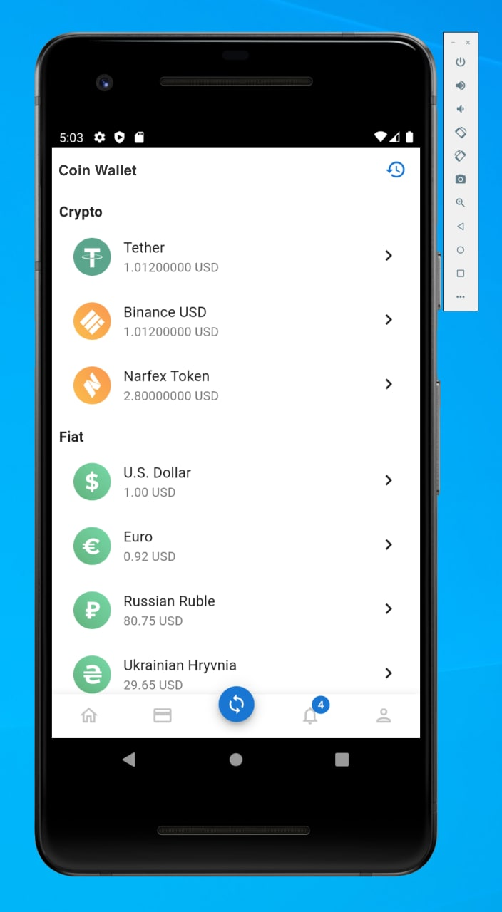

# cordova-coin-wallet

> A [react-declarative](https://github.com/react-declarative/react-declarative) lib example based on mobile app on [Apache Cordova](https://cordova.apache.org/)



## Usage

```
npm install
npm run build
npm run build:cordova
```

## Development Guide

### Deploy static web server

```
npm run serve
```

### Run Chrome without CORS Policy

OSX: `open -n -a /Applications/Google\ Chrome.app/Contents/MacOS/Google\ Chrome --args --user-data-dir="/tmp/chrome_dev_test" --disable-web-security`

Windows: `"C:\Program Files (x86)\Google\Chrome\Application\chrome.exe" --disable-web-security --user-data-dir="C://ChromeDev"`

Linux: `google-chrome --disable-web-security --user-data-dir="/tmp/chrome_dev_test"`
